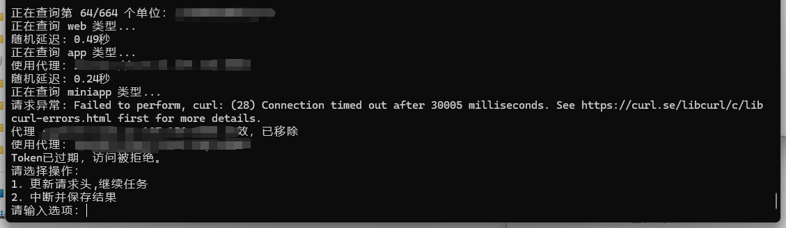

# 半自动化ICP备案信息批量查询

## 概述

半自动化查询指定公司名称的ICP备案信息（域名、APP、小程序）

> 做集团资产测绘，要查几百家公司的ICP备案信息，部分公开站点备案信息过时，不满足时效性要求，还是得通过ICP/IP地址/域名信息备案管理系统查询最新的
>
> 备案系统的文字验证码有点太折磨人
>
> token等认证信息有效时间太短也折磨人

## 功能

1. 单公司名称查询（不实用）
2. 指定文件查询多个公司ICP备案信息
3. 通过代理快速查询多个公司ICP备案信息
4. 手动更新cookie等认证信息继续查询
5. 将查询结保存到本地文件中。

## 依赖

- Python 3.x

你可以通过以下命令安装所需的库：

```bash
pip install requests curl_cffi pandas
```

## 认证信息获取

备案系统点完文字验证码后即可获取四个认证头

> 主要接口：https://hlwicpfwc.miit.gov.cn/icpproject_query/api/icpAbbreviateInfo/queryByCondition

## 使用方法

1. **运行脚本**：

```bash
   python ICP.py [-h] [-f FILE] [-o OUTPUT] [-t {web,app,miniapp,all}] [-p PROXY_ROTATE] [unit_name]
   ICP备案查询工具

positional arguments:
  unit_name             查询的单位名称

options:
  -h, --help            show this help message and exit
  -f FILE, --file FILE  从文件读取单位名称列表
  -o OUTPUT, --output OUTPUT
                        输出文件名
  -t {web,app,miniapp,all}, --type {web,app,miniapp,all}
                        查询类型（域名、APP、小程序、全部）
  -p PROXY_ROTATE, --proxy_rotate PROXY_ROTATE
                        启用代理且每N个请求更换代理
```

2. **查询单公司**

   ```
   python ICP.py 上海宽娱数码科技有限公司 -t all
   ```

   

3. **查询多个公司**

   ```
   python ICP.py -f Company.txt -t all
   ```

   

4. **查询多个公司(代理)**

   ```
   python ICP.py -f Company.txt -t all -p 3
   ```

   

   **token过期时可以手动重新获取token，选1然后更新对应的4个请求头即可**

   

查询结果：


## 待更新：

认证头自动化更新

代理处理逻辑

## 警告
本项目仅限用于学习研究

禁止售卖本项目，禁止用于违法目的

任何后果与本人无关
